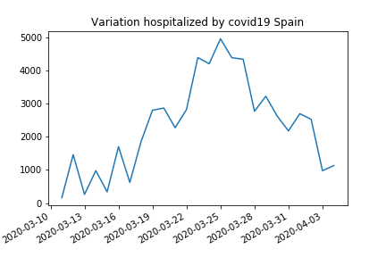

# Covid19 notebook. People hostipalized in Spain.
In this notebook, I try to analyze data from covid19 in Spain. I examine the variation of people hospitalized by covid19. We use data from the Spanish government download from https://covid19.isciii.es/resources/serie_historica_acumulados.csv

I used data from hospitalized people because the data from detected cases  depend on the number of tests, and the number of dead people is 15 days late concerning infections

