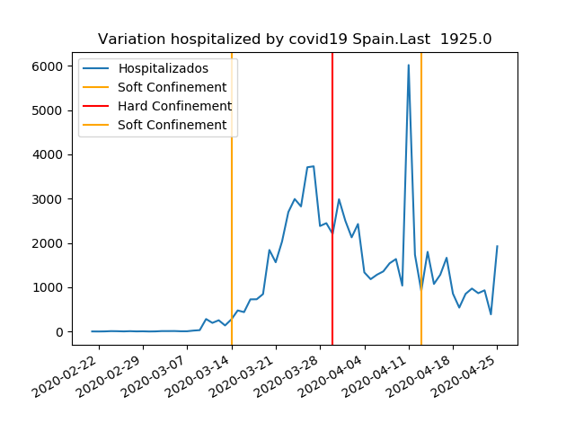
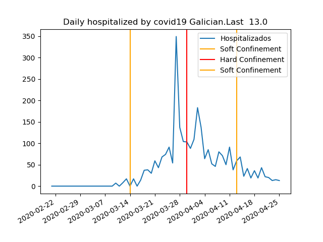
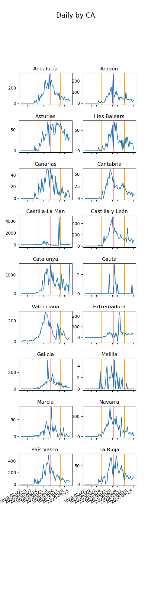

# Covid19 notebook. People hostipalized in Spain.
I try to analyze data from covid19 in Spain. 
I examine the variation of people hospitalized by covid19. 
We use data from the Spanish government download from 
[here](https://covid19.isciii.es/resources/serie_historica_acumulados.csv)

I used data from hospitalized people because the data from detected cases  depend on the number of tests, 
and the number of deaths can vary according to the criteria used.

## Files
* Coronavirus.ipynb .- Jupyter notebook
* main.py .- Process data /Google cloud function
* index.html .- Web page displays graph create with main.py

You can see the data update daily in [link](https://storage.googleapis.com/covid19-jota/index.html)









## Google Cloud Funcions + Web Page
1. Create project
```console
gcloud projects create PROJECT_ID
```
2. Export credentials
```console
export GOOGLE_APPLICATION_CREDENTIALS="./covid19-jota-59ba6be5c3d7.json"
```
3. Create bucket
```console
gsutil mb gs://[BUCKET_NAME]/
```
4. Test local
```console
python main.py
```
5. Deploy function
```console
gcloud functions deploy do_calc --trigger-topic HOSPITALICED_CALC --runtime python37
```
6. Test in cloud
```console
gcloud functions call do_calc --data='{"message": "Hello World!"}'
```

7. Create google cloud scheduler that send a pub/sub topic named HOSPITALICED_CALC
8. Upload web page
```console
gsutil cp index.html  gs://covid19-jota/
gsutil cp -r css/   gs://covid19-jota/
```
